# A Arte da Convolução

## Propósito

Esse repositório tem como fim unica e exclusivamente o estudo do processo de convolução.

### Mas o que é uma convolução?

Segundo a documentação do GIMP:

> It's possible to get a rough idea of it without using mathematical tools that only a few ones know. Convolution is the treatment of a 
> matrix by another one which is called “kernel”.
> <p align="right"><a href="https://docs.gimp.org/2.2/en/plug-in-convmatrix.html">GNU Image Manipulation Program</a></p>

### E onde pode ser aplicado?

O processo de convolução é amplamente aplicado em tratamento de imagens, entretanto, vem sendo aplicado em larga escala na identificação de padrões visuais utilizando aprendizagem profundo. A fundação desse conceito na área de Inteligência Artificial é comumente atribuido a [Yann LeCun](http://yann.lecun.com/exdb/lenet/) - um verdadeiro gigante da área da tecnologia.

### Instalação

A instalação pode ser realizada através do gerenciado de pacotes [PIP](https://bootstrap.pypa.io/get-pip.py).

```console
wall@kalingth:~$ pip install kalinvolution
A lot of characters will appear here.
More letters...
... blah ...
... blah ...
... blah ...
-- Oh no!!!
... blah ...
... blah ...
... blah ...
** Done! **
wall@kalingth:~$ 
```

### Como utilizar esse pacote?

Inicialmente, criarei uma versão para tratamento apenas de imagens. Futuramente, terminarei de processar o módulo para convolução de todos os frames contidos em um vídeo.

Para convolucionar imagens, o método mais simples é instanciando um objeto ImageEffect passando o nome do arquivo de entrada e o nome do arquivo de saída. Posteriormente, basta chamar o método run e o objeto irá convolucionar a imagem, mostrar a saída da convolução por 2 segundos e então exportar o arquivo de saída. O método run pode receber o nome do tipo de convolução desejado.

Caso nenhum parâmetro seja chamado durante a instanciação do objeto, será processada a imagem de um guaxinim (Tanuki!!) presente na biblioteca scipy.

Para melhor exemplificação, vide o código abaixo:

```python3
>>> from kalinvolution.Images import ImageEffect 
>>> image = ImageEffect()
>>> image.run('Emboss')
```

| Imagem Original                | Imagem Convolucionada          |
| :----------------------------: | :----------------------------: |
|         | 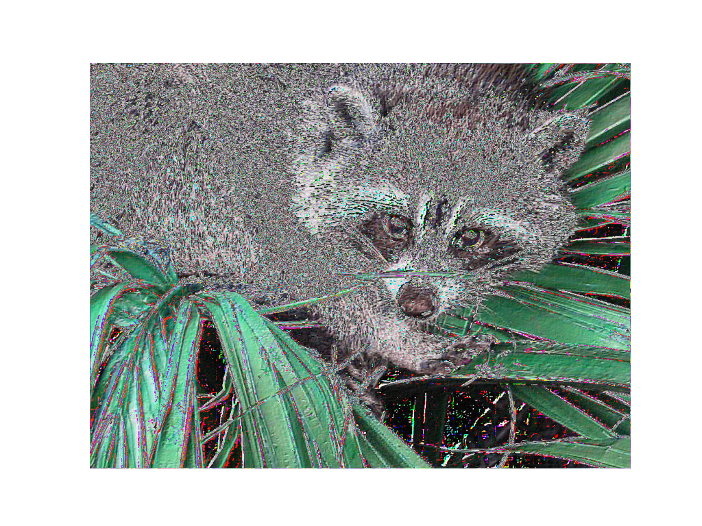 |


### Adicionais

Como o campo do tratamento de imagens é extremamente interessante, pretendo criar outros tratamentos por diversão.
Atualmente, um tratamento que me diverti bastante foi o "AhaEffect" onde tento simular o efeito do videoclip Take On Me da banda A-Ha. Daí surgiu o interesse posterior em criar um módulo para tratamento dos frames de vídeos.


## Principais Kernels

Abaixo é possível verificar a saída de cada kernel. Neste projeto, realizei a convolução dos três canais de cores: RGB (Red, Green e Blue).

|                 Respectivas Saídas de Cada Convolução                  ||
| :-----------------------------: | :-----------------------------------: |
| Tanuki Identity                 | Tanuki Blur                           |
|   | 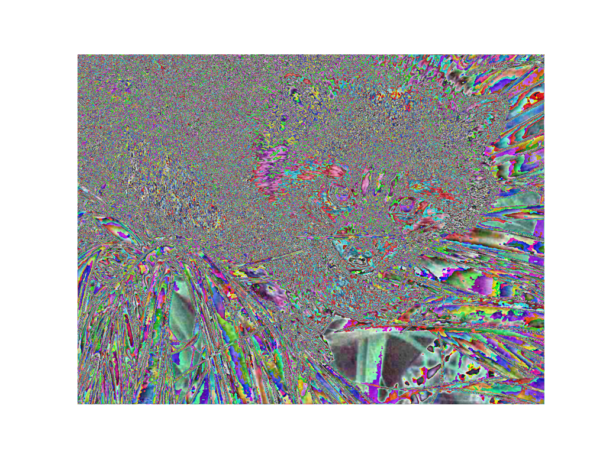            |
| Tanuki Gaussian Blur            | Tanuki Gaussian Blur With 5x5 Matrix  |
|   | 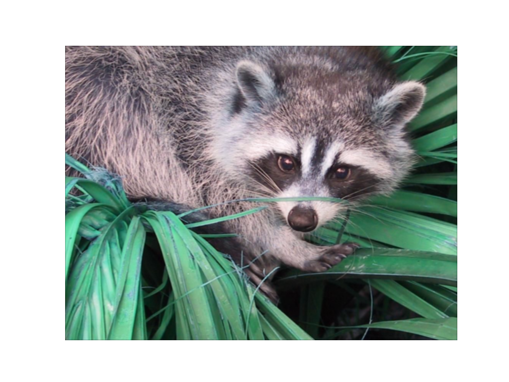    |
| Tanuki Box Blur                 | Tanuki Edge                           |
|    | 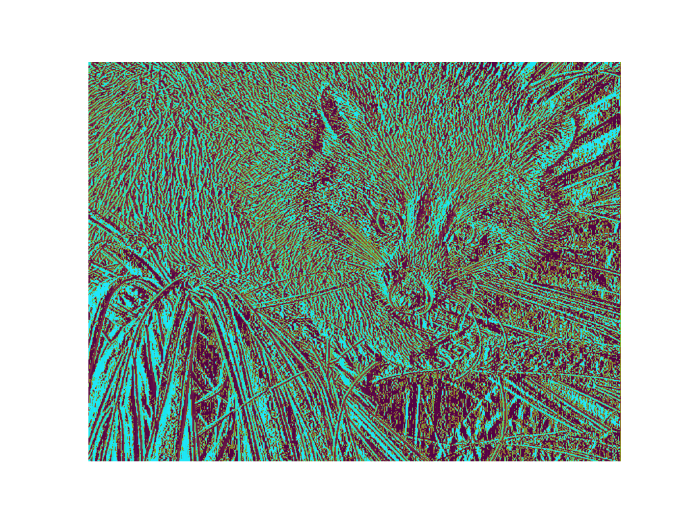            |
| Tanuki Edge Variation One       | Tanuki Edge Variation Two             |
| 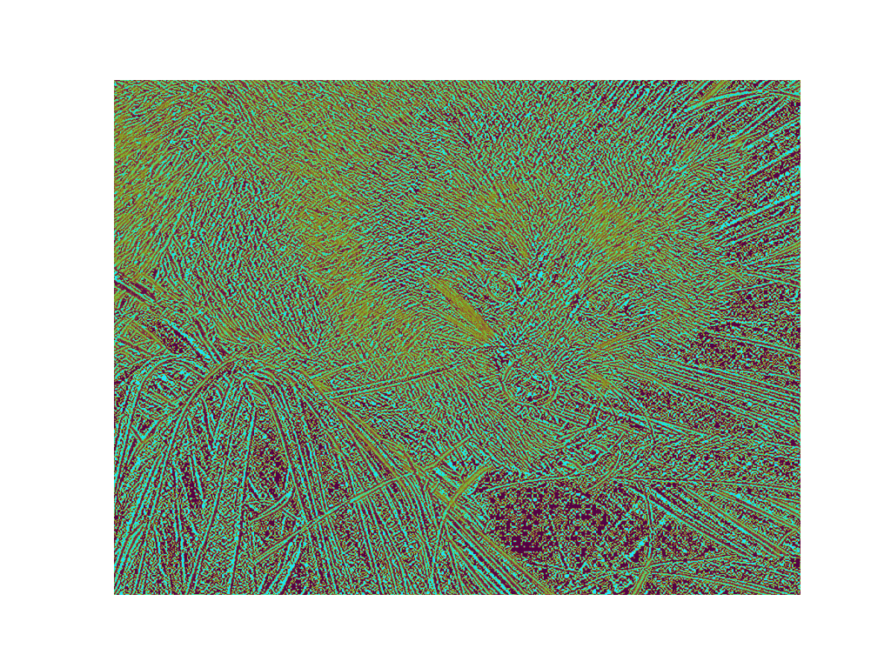   | 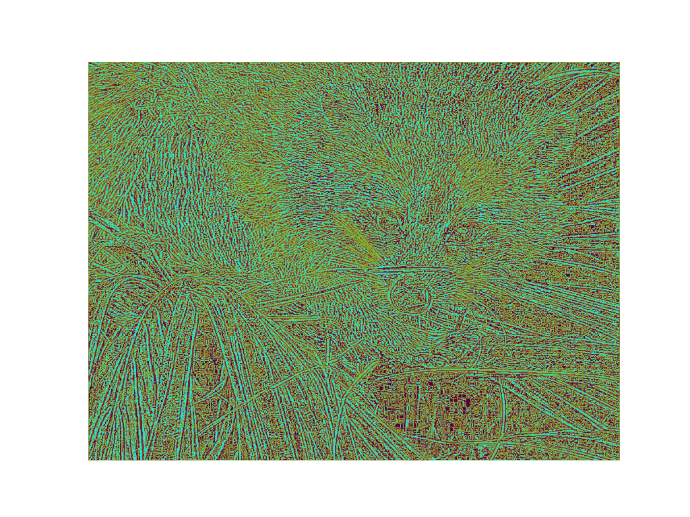         |
| Tanuki Edge Variation Three     | Tanuki Edge Variation Four            |
| 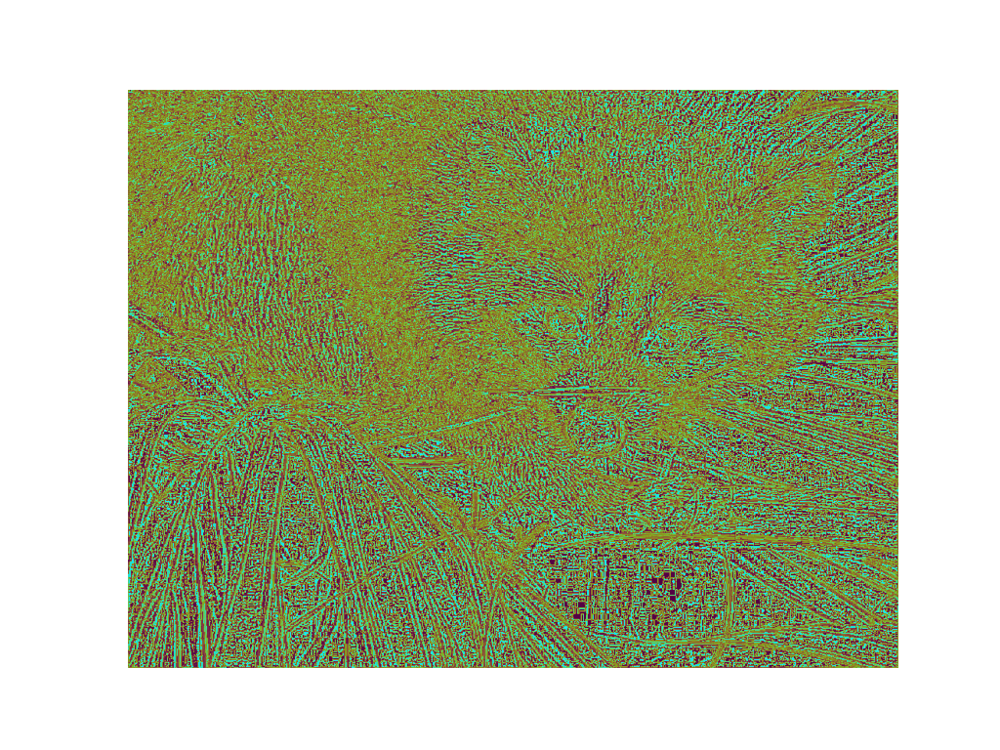 | 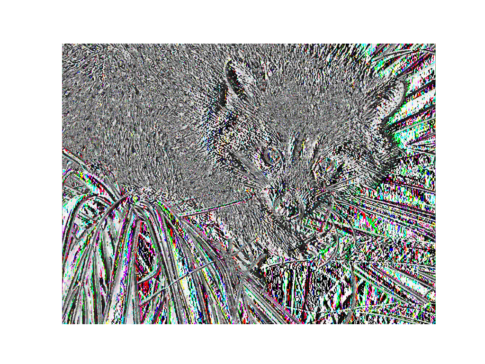        |
| Tanuki Scharr                   | Tanuki Emboss                         |
| 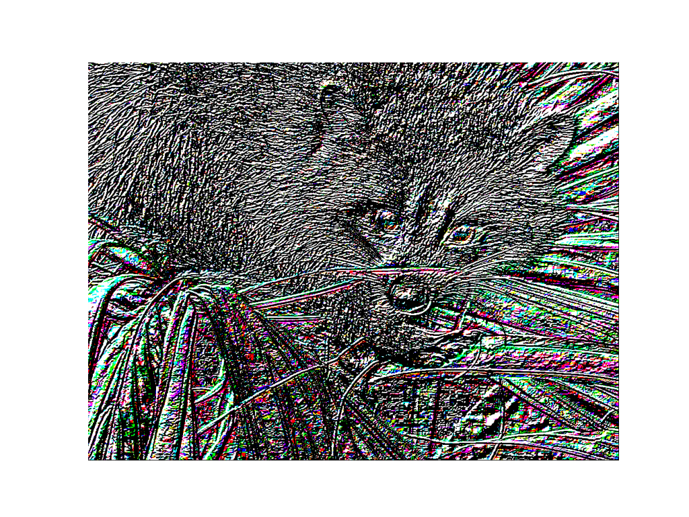    |           |
| Tanuki Sharpen                  | Tanuki Unsharp                        |
|    | 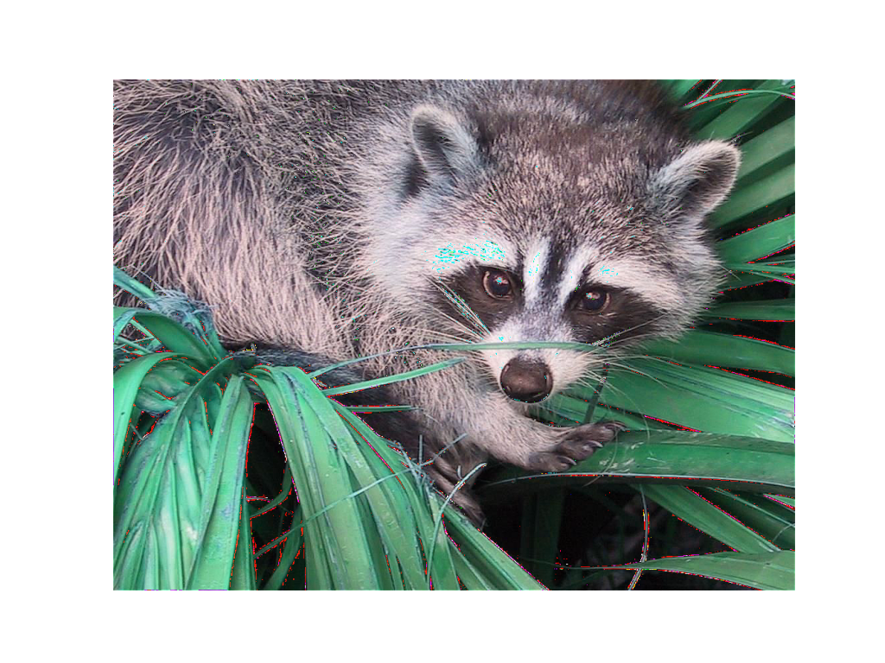         |
| Tanuki Sobel                    | Tanuki Aha Effect                     |
| 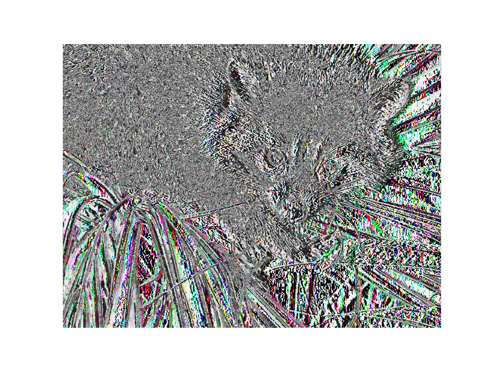     | 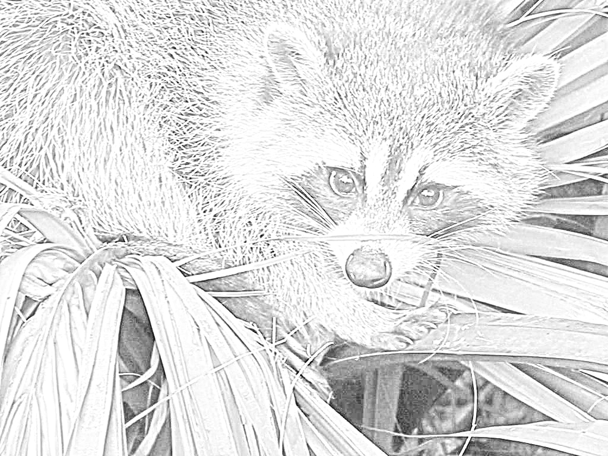       |


## Estrutura de Arquivos do Projeto

Abaixo é possível encontrar a estrutura de arquivos e diretórios desse projeto.

```
ROOT
│   .gitignore
│   output.png
│   output_AhaEffect.png
│   output_Blur.png
│   output_BoxBlur.png
│   output_Custom.png
│   output_Edge.png
│   output_EdgeFour.png
│   output_EdgeOne.png
│   output_EdgeThree.png
│   output_EdgeTwo.png
│   output_Emboss.png
│   output_GaussianBlur.png
│   output_GBW5x5Kernel.png
│   output_Identity.png
│   output_Scharr.png
│   output_Sharpen.png
│   output_Sobel.png
│   output_Unsharp.png
│   README.md
│   
└───convolution
    │   Images.py
    │   __init__.py
    │   
    ├───Misc
    │       CONSTANTS.py
    │       __init__.py
    │       
    └───Processors
            FrameProcessor.py
            __init__.py
```

## Author

[Wallace Rocha - Kalingth.](https://www.linkedin.com/in/htgnilak/)

## Licensing

[Sou Adepto ao Copyleft :)](https://choosealicense.com/licenses/mpl-2.0/)